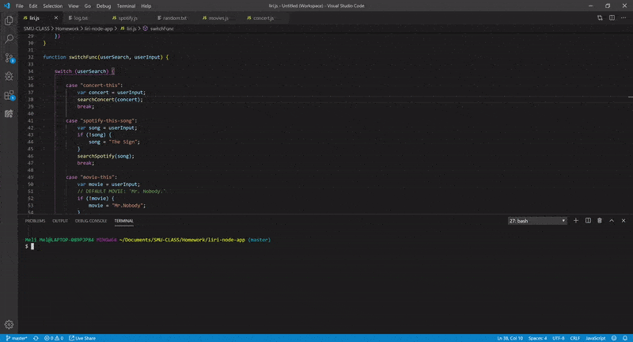
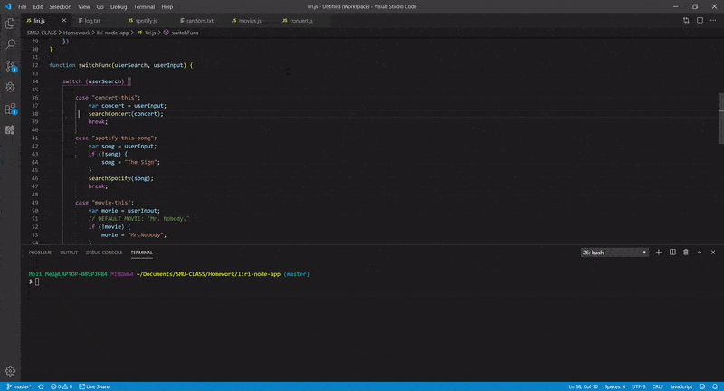
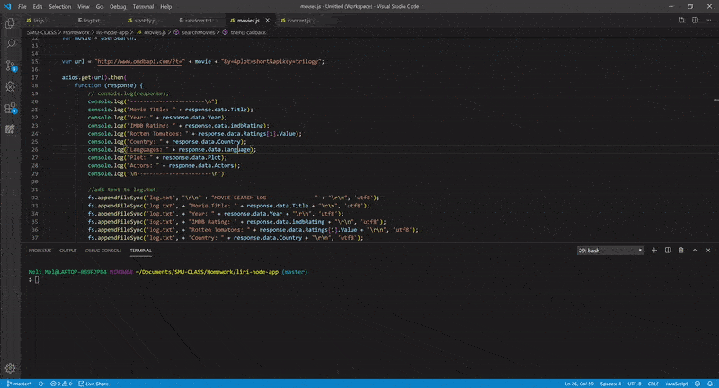
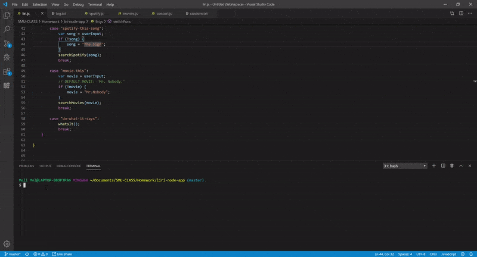

# Liri - Command Line App

ABOUT
LIRI is a Language Interpretation and Recognition Interface app. LIRI will be a command line node app that takes in parameters and gives you back data.


HOW THE APP WORKS
1. Type in one of the following inputs in the command line:

```

a) node liri.js spotify-this-song '<song name here>'
  - This command prompts the Spotify API, and outputs the following information to your terminal/bash window:
    -- Artist(s)
    -- The song's name
    -- A preview link of the song from Spotify
    -- The album that the song is from
  

  
b) node liri.js concert-this '<artist/band name here>'
  -This command prompts the Bands in Town API, and outputs the following information to your terminal/bash window:
    -- Name of the venue
    -- Venue location
    -- Date of the Event

   - If no song is provided then Liri will default to "The Sign" by Ace of Base.
   
 
c) node liri.js movie-this '<movie name here>'
  -This command prompts the OMDB API, and outputs the following information to your terminal/bash window:
   -- Title of the movie.
   -- Year the movie came out.
   -- IMDB Rating of the movie.
   -- Rotten Tomatoes Rating of the movie.
   -- Country where the movie was produced.
   -- Language of the movie.
   -- Plot of the movie.
   -- Actors in the movie.

   - If no movie is provided then Liri will default to "Mr.Nobody".

  
d) node liri.js do-what-it-says
  -This command pulls its commands from the random.txt file, and runs spotify-this-song for "I Want it That Way".
  
```


## PACKAGES TO INSTALL
To retrieve the data that will power this app, you'll need to send requests using the following packages: 
```
Node-Spotify-API
Axios (grabs data from the OMDB API and the Bands In Town API)
Moment
DotEnv
```

All results are recorded in the log.txt file

### SEE EXAMPLES BELOW

## SPOTIFY-THIS <br> 


## CONCERT-THIS <br>


## MOVIE-THIS <br>


## DO-WHAT-IT-SAYS <br>


